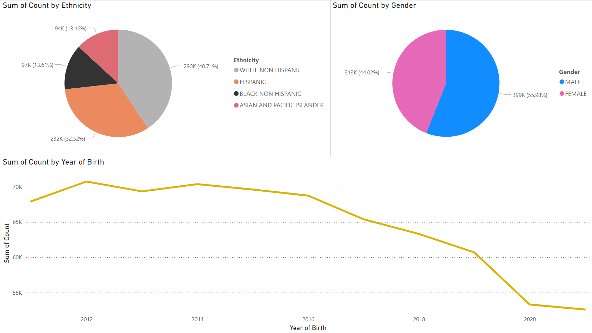
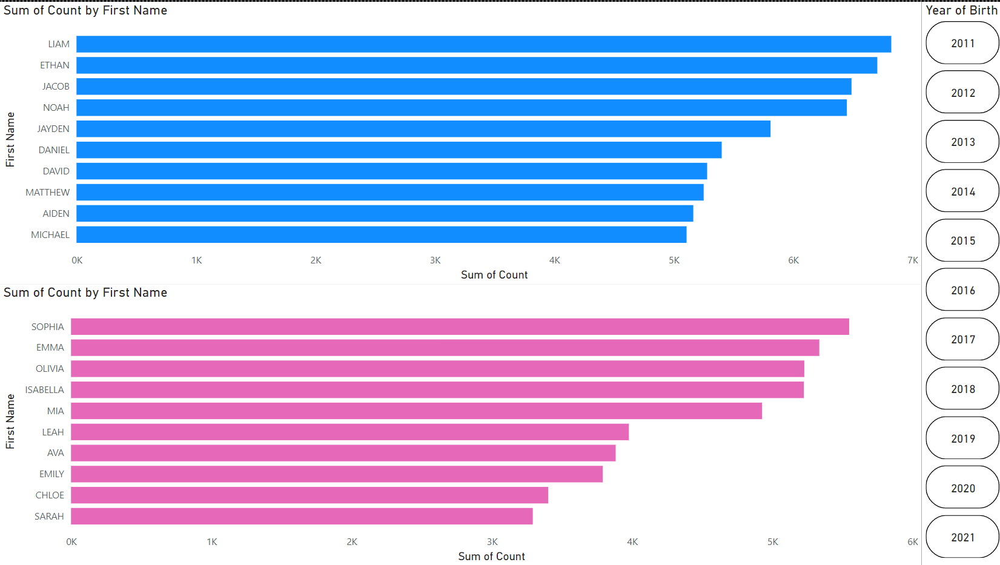

# Baby Name Analysis Project
KU Boot Camp Project 4

## Overview

This project analyzes popular baby names by sex and ethnic group in New York City from 2011 to 2021. The data, collected through civil birth registration, was last updated on June 15, 2024. Each record represents the ranking of a baby name in order of frequency, providing insights into name popularity trends.

## Team White Cast

- Albert Lee
- Jay Singh
- Austen Ortmeier
- Ryan Fagan

## File Structure

1. **Code Directory**
   - `02_Transform.ipynb`: Data preprocessing
   - `03_Load.ipynb`: Loading data into MongoDB
   - `04_Model-Training.ipynb`: Train Markov model

2. **Output Directory**
   - Contains cleaned CSV files of baby names data and trained Markov model in json

3. **Resource Directory**
   - Contains the original dataset

4. **Test Code Directory**
   - `app.py`: Main application file that runs the Flask server and handles routes
   - **Static Directory**
     - **CSS Directory**: `style.css` - Defines the styling for the web application
     - **JS Directory**: `app.js` - Contains client-side JavaScript for interactive features
   - **Templates Directory**:
     - `index.html` - The main HTML template for the web application
     - `powerbi.html` - HTML file to display Power BI visualizations as PNG files

## Setup and Usage

1. **Prerequisites**: 
   - Install Python and MongoDB

2. **Installation**:
   - Clone the repository: `git clone https://github.com/ChairLeg39/baby-name-project-4`

3. **Data Loading**:
   - Run the `03_Load.ipynb` notebook to load the collection into MongoDB

4. **Running the Application**:
   - Ensure MongoDB is running
   - Execute `python app.py` located in the Flask-App directory

## Functionality

When you run `app.py`, you'll be directed to the landing page. Here's a breakdown of the functionality:

1. **Landing Page**: 
   - Features a baby name creator using the Markov chain model
   - Contains navigation links at the top

2. **Navigation Links**:
   - **Popular Baby Names**: Displays a JSONified version of our dataset
   - **Dataset**: Links to the original data source URL
   - **PowerBI**: Opens a separate page (`powerbi.html`) showing two Power BI visualization images
   - **Baby Names Dashboard**: Links to a separate project hosted on GitHub
     - URL: [Baby Names Dashboard](https://chairleg39.github.io/baby-name-dashboard/)

3. **Baby Names Dashboard**:
   - Features a random name generator based on gender and ethnicity
   - Includes a dropdown menu to select names
   - Displays metadata for selected names
   - Shows a bubble chart visualization with years on the x-axis and name count on the y-axis
   - Bubble size indicates name popularity

4. **Baby Name Creator**:
   - Located on the main landing page
   - Two dropdown menus for selecting gender and ethnicity
   - Generates a new name based on the Markov trained model using the selected criteria

> **📝 Note:** The Markov chain model for name generation analyzes the existing names in the dataset to understand the probability of one character following another. When generating a new name, it starts with a random character and then selects subsequent characters based on these probabilities. This process continues until a full name is generated. The result is a new name that statistically resembles the names in the original dataset.

## Data Sources

- Original dataset: [Popular Baby Names](https://catalog.data.gov/dataset/popular-baby-names)

## Research Questions and Findings

1. What were the most popular baby names of the decade across all ethnicities?
2. What is the typical length range for popular baby names?
3. How is the dataset distributed across ethnicities?
4. What are the gender distribution patterns in the dataset?
5. How has the proportion of white babies changed over the decade?
6. What trends can be observed in the number of babies in the dataset over the years?

### Key Findings:

- Most popular baby names of the decade:
  - Female: Sophia
  - Male: Liam

- Typical name length: Popular baby names generally range from 3 to 9 characters long, with Christopher being a notable exception.

- Ethnic distribution in the dataset:
  - White babies: Approximately one-third
  - Hispanic babies: Approximately one-third
  - Black and Asian babies: Collectively make up the remaining third, split evenly

- Gender distribution:
  - Overall: Slightly more male babies than female
  - Among white babies: More evenly split compared to other ethnicities

- Trends over time:
  - The proportion of white babies in the dataset increased from 2011 through 2021.
  - The total number of babies in the dataset remained relatively consistent year by year, with a slight decrease towards the end of the decade.

## Visualizations

Power BI was used for answering some research questions. Below are the dashboards created:

> **Note:** This repository has few commits as the majority of the work was done collaboratively in person, with changes consolidated before pushing to the repository.
